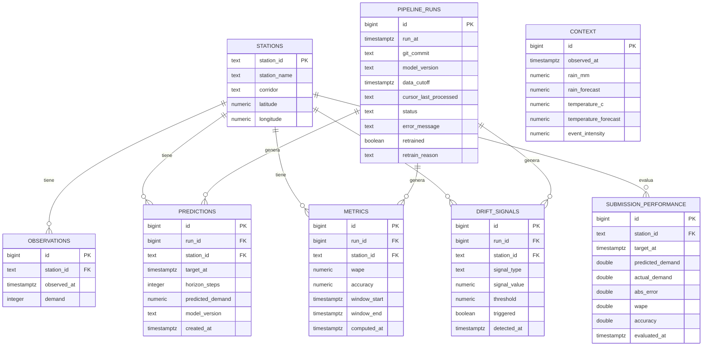

# Diagrama entidad-relación — Supabase (Pulso TransMi)

Proyecto Supabase: **pulso-transmi** (`azqudvlltukeeuypivcq`, región `sa-east-1`).
URL: `https://azqudvlltukeeuypivcq.supabase.co`

## Diagrama


```mermaid
erDiagram
    STATIONS ||--o{ OBSERVATIONS : "tiene"
    STATIONS ||--o{ PREDICTIONS : "tiene"
    STATIONS ||--o{ METRICS : "tiene"
    STATIONS ||--o{ DRIFT_SIGNALS : "tiene"
    STATIONS ||--o{ SUBMISSION_PERFORMANCE : "evalua"
    PIPELINE_RUNS ||--o{ PREDICTIONS : "genera"
    PIPELINE_RUNS ||--o{ METRICS : "genera"
    PIPELINE_RUNS ||--o{ DRIFT_SIGNALS : "genera"

    STATIONS {
        text station_id PK
        text station_name
        text corridor
        numeric latitude
        numeric longitude
    }
    OBSERVATIONS {
        bigint id PK
        text station_id FK
        timestamptz observed_at
        integer demand
    }
    CONTEXT {
        bigint id PK
        timestamptz observed_at
        numeric rain_mm
        numeric rain_forecast
        numeric temperature_c
        numeric temperature_forecast
        numeric event_intensity
    }
    PIPELINE_RUNS {
        bigint id PK
        timestamptz run_at
        text git_commit
        text model_version
        timestamptz data_cutoff
        text cursor_last_processed
        text status
        text error_message
        boolean retrained
        text retrain_reason
    }
    PREDICTIONS {
        bigint id PK
        bigint run_id FK
        text station_id FK
        timestamptz target_at
        integer horizon_steps
        numeric predicted_demand
        text model_version
        timestamptz created_at
    }
    METRICS {
        bigint id PK
        bigint run_id FK
        text station_id FK
        numeric wape
        numeric accuracy
        timestamptz window_start
        timestamptz window_end
        timestamptz computed_at
    }
    DRIFT_SIGNALS {
        bigint id PK
        bigint run_id FK
        text station_id FK
        text signal_type
        numeric signal_value
        numeric threshold
        boolean triggered
        timestamptz detected_at
    }
    SUBMISSION_PERFORMANCE {
        bigint id PK
        text station_id FK
        timestamptz target_at
        double predicted_demand
        double actual_demand
        double abs_error
        double wape
        double accuracy
        timestamptz evaluated_at
    }
```

## Justificación del modelo

- **`stations`** replica el catálogo geográfico de la API (`/v1/stations`) — 12 filas fijas.
- **`observations`** replica la demanda observada (`/v1/observations`). Clave única
  `(station_id, observed_at)` para poder hacer upsert idempotente cuando el
  pipeline incremental traiga solo periodos nuevos.
- **`context`** replica clima/eventos (`/v1/context`). No tiene FK a estación
  porque el contexto no es por estación — se une por `observed_at`.
- **`pipeline_runs`** es el registro de cada ejecución del workflow de GitHub
  Actions: guarda el commit, el cutoff de datos usado, si hubo reentrenamiento
  y por qué, y si la corrida fue exitosa o falló (trazabilidad que pide
  `docs/student-project.md`).
- **`predictions`** guarda cada predicción emitida, ligada a la corrida que la
  generó (`run_id`) y a la estación, con el horizonte y la versión del modelo.
- **`metrics`** guarda WAPE/Accuracy calculados por corrida (agregados o por
  estación si `station_id` no es null). **Limitación conocida**: no tiene
  columna para identificar a qué modelo corresponde cada fila (naive/
  estacional/GBR/mezcla) — por eso el dashboard en vivo usa
  `submission_performance` como fuente principal de accuracy real en vez de
  esta tabla.
- **`drift_signals`** guarda señales de data/concept drift detectadas por
  corrida (cambio de demanda media semana vs. semana anterior, por
  estación), con su umbral y si se disparó o no.
- **`submission_performance`** (agregada después del diseño inicial) guarda
  el desempeño REAL de cada predicción enviada al reto, una vez el profesor
  publica el dato real correspondiente: `scripts/eval_performance.py` la
  compara contra `observations` y calcula `wape`/`accuracy` con la misma
  fórmula que la validación interna (`accuracy = 100 * (1 - wape)`,
  acotado en 0). Clave única `(station_id, target_at)`. No tiene `run_id`
  porque una misma predicción puede evaluarse en una corrida distinta a la
  que la generó (el dato real tarda horas en publicarse). Es la fuente de
  verdad que usa el dashboard en vivo de Vercel y la que el portal del
  reto refleja como accuracy real del estudiante.

Todas las tablas tienen RLS activado con una política de **lectura pública**
(para que el dashboard en Vercel pueda leer directo con la
`anon`/`publishable key`). La escritura está restringida a la
`service_role key` (usada solo desde GitHub Actions, nunca expuesta en el
navegador): en `submission_performance` hay una política explícita que
exige `auth.role() = 'service_role'` para cualquier escritura; en el resto
de tablas no hay política de escritura definida, así que RLS las bloquea
por defecto para cualquier rol que no sea `service_role`.

## Variables de entorno para el pipeline

```
SUPABASE_URL=https://azqudvlltukeeuypivcq.supabase.co
SUPABASE_KEY=<service_role key, guardarla como secret en GitHub, nunca en el código>
```

Para el dashboard (lectura pública, sí se puede exponer en el frontend):

```
SUPABASE_URL=https://azqudvlltukeeuypivcq.supabase.co
SUPABASE_PUBLISHABLE_KEY=sb_publishable_9-jIuyLuPm_TqJ3KQ1zhAg_gSLIV8H4
```

(la `anon key` legada `eyJhbGciOiJIUzI1NiIs...` sigue funcionando igual,
Supabase mantiene ambas activas).
